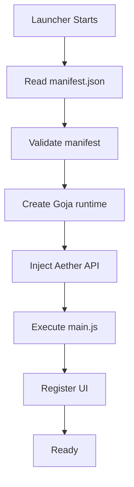

# Extension API & Sandbox

Aether executes extension backend scripts inside an isolated **Goja JavaScript runtime**. 

> [!WARNING]
> This backend environment is **NOT** a browser or a Node.js environment. The following APIs are unavailable:
> - `window`
> - `document`
> - `fetch` (unless explicitly provided via `Aether.http.get`)
> - `localStorage`
> - `require()`
> - `process`, `fs`, `child_process` (and all other Node.js modules)

Instead, your script interacts with the launcher core via the injected `Aether` global object.

## The `Aether` Global Object

When your extension's `main.js` is executed, the `Aether` object is injected into the global scope. The capabilities attached to this object depend strictly on the permissions requested in your `manifest.json`.

### UI Registration (`ui:sidebar`)
Allows the extension to register a frontend UI tab.

- `Aether.ui.registerSidebarPage(options)`
  - **options** (Object):
    - `id` (String): A unique identifier for the tab.
    - `label` (String): The text displayed on the tab.
    - `url` (String): The path to your UI HTML file, relative to your extension's root directory (e.g., `"ui/index.html"`).

### Dialogs (`dialogs:open`)
*(Coming Soon)*
- `Aether.ui.openDialog(options)`

### Instance Management (`instances:patch`)
Allows the extension to programmatically query and modify instances.

- `Aether.instances.list()`
  - Returns an array of objects representing all installed instances: `[{ id, name, version, loader }]`.
- `Aether.instances.installMod(instanceId, jarName, downloadURL)`
  - **instanceId** (String): The ID of the instance to modify.
  - **jarName** (String): The filename to save the mod as (e.g. `fabric-api.jar`).
  - **downloadURL** (String): The URL to download the mod from (must be allowed in `hosts`).
- `Aether.instances.listMods(instanceId)`
  - **instanceId** (String): The ID of the instance.
  - Returns an array of strings representing the filenames in the `mods` folder.
- `Aether.instances.deleteMod(instanceId, jarName)`
  - Deletes the specified mod file from the instance.
- `Aether.instances.toggleMod(instanceId, jarName, enable)`
  - **enable** (Boolean): True to enable, false to disable.
  - Disabling a mod renames it to `.jar.disabled`. Enabling it renames it back to `.jar`.

### Mod Loader Registration (`launcher:modloader`)
Allows the extension to register a custom mod loader that Aether can use to launch instances.

- `Aether.launcher.registerModLoader(config)`
  - **config** (Object):
    - `id` (String): A unique identifier for the loader.
    - `name` (String): The display name of the loader.
    - `description` (String): A brief description of the loader.
    - `onLaunch` (Function): A callback executed when an instance with this loader is launched.

### Skin Management (`skin:export`)
Allows the extension to write base64 encoded skins to the local filesystem.

- `Aether.skins.export(base64Data, filename)`
  - **base64Data** (String): The skin image encoded as a base64 string.
  - **filename** (String): The name to save the skin as (e.g., `skin.png`). Returns the saved file path.

## Network Access
By default, the backend Sandbox cannot access the network. To make HTTP requests, you must request `network:http` in your permissions and use the provided `Aether.http.get(url)` API.
Direct browser `fetch()` is intentionally omitted from the backend sandbox to ensure all requests pass through Aether's domain whitelisting, logging, and rate-limiting systems.

*Note: Your frontend UI (running in the iframe) CAN use Aether's provided native `fetch()` because it operates under standard web security models, but this may be restricted in the future for security reasons.*

## File System Access
By default, the backend Sandbox cannot download arbitrary files.
- `Aether.fs.download(url, dest)` (requires `fs:download` permission)
  - Downloads a file from the given URL (must be allowed in `hosts`) into the isolated instances/libraries folder.

## Communication with the Frontend (Iframe)
Your frontend UI runs in an `<iframe>` served by a local HTTP server. Because it's isolated, it cannot call the `Aether` Go API directly.

To communicate between your UI and the backend Goja sandbox, use the built-in IPC bridge.

### 1. In your Backend Script (`main.js`)
You can register a listener using `Aether.ui.onMessage`. Any data returned by this function is automatically sent back to the frontend UI as a response. You can also push messages down to the frontend UI without a prompt using `Aether.ui.postMessage`.

```javascript
// Listen for messages from the frontend
Aether.ui.onMessage((payload) => {
    if (payload.action === 'download_mod') {
        const path = Aether.instances.installMod(payload.instanceId, payload.jarName, payload.url);
        return { status: 'success', path: path }; // Sent back to frontend
    }
});

// Push a message to the frontend unconditionally
Aether.ui.postMessage({ type: 'download_progress', percent: 50 });
```

### 2. In your Frontend UI (`index.html`)
Because the frontend runs in an isolated `<iframe>`, you use standard Web APIs (`window.postMessage`) to talk to the bridge, and listen for responses via `window.addEventListener('message')`.

```javascript
// Send a message to your backend script
window.parent.postMessage({
    action: 'download_mod',
    instanceId: 'fabric-1.20',
    jarName: 'my-mod.jar',
    url: 'https://example.com/mod.jar'
}, '*');

// Listen for responses or pushed messages from the backend script
window.addEventListener('message', (event) => {
    if (event.data.status === 'success') {
        console.log("Mod downloaded to: ", event.data.path);
    }
});
```

## Lifecycle



### Lifecycle Callbacks (Planned)
Future API versions will introduce explicit lifecycle callbacks so your extension can run setup or cleanup logic predictively:
- `onLoad()`
- `onEnable()`
- `onDisable()`
- `onUnload()`
- `onUpdate()`

## Events (Planned)
Future API versions will allow extensions to subscribe to core launcher events:
- `Aether.events.on('instance:launch', (id) => { ... })`
- `Aether.events.on('instance:stop', (id) => { ... })`

## API Version Negotiation
Extensions must declare the `api` version they target in their `manifest.json`. Aether will inject the appropriate capability shapes based on this version to ensure backwards compatibility. You can optionally define `minApi` and `maxApi` to restrict which versions of the launcher can load your extension.

## Extended Permissions Model

Current permissions:
- `ui:sidebar`
- `ui:dialogs`
- `instances:patch`
- `network:http`
- `fs:download`
- `launcher:modloader`
- `skin:export`

Future granular permissions:
- `instances:read`, `instances:write`
- `settings:read`, `settings:write`
- `launcher:launch`, `launcher:stop`
- `downloads:start`, `downloads:cancel`
- `notifications:show`
- `clipboard:read`, `clipboard:write`
- `extensions:list`
