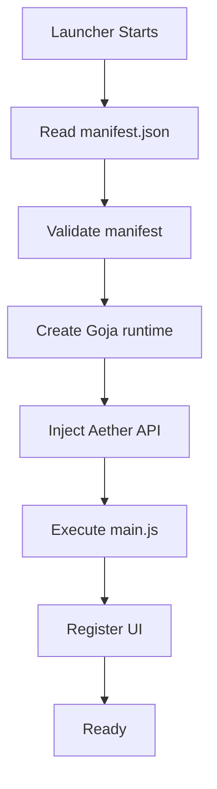

# Extension API & Sandbox

Aether executes extension backend scripts inside an isolated **Goja JavaScript runtime**. 

> [!WARNING]
> This backend environment is **NOT** a browser or a Node.js environment. The following APIs are unavailable:
> - `window`
> - `document`
> - `fetch` (unless explicitly provided via `Aether.network.fetch`)
> - `localStorage`
> - `require()`
> - `process`, `fs`, `child_process` (and all other Node.js modules)

Instead, your script interacts with the launcher core via the injected `Aether` global object.

## The `Aether` Global Object

When your extension's `main.js` is executed, the `Aether` object is injected into the global scope. The capabilities attached to this object depend strictly on the permissions requested in your `manifest.json`.

### UI Registration (`ui:sidebar`)
Allows the extension to register a frontend UI tab.

- `Aether.ui.registerSidebarPage(options)`
  - **options** (Object):
    - `id` (String): A unique identifier for the tab.
    - `label` (String): The text displayed on the tab.
    - `url` (String): The path to your UI HTML file, relative to your extension's root directory (e.g., `"ui/index.html"`).

### Dialogs (`dialogs:open`)
*(Coming Soon)*
- `Aether.ui.openDialog(options)`

### Instance Management (`instances:patch`)
Allows the extension to programmatically modify instance JSON files. This is primarily used for installer extensions (like Fabric or Forge).

- `Aether.instances.patch(instanceId, patchData)`
  - **instanceId** (String): The ID of the instance to patch.
  - **patchData** (Object): The JSON data to merge or inject into the instance's version manifest.

## Network Access
By default, the backend Sandbox cannot access the network. To make HTTP requests, you must request `network:fetch` in your permissions and use the provided `Aether.network.fetch()` API (planned).
Direct browser `fetch()` is intentionally omitted from the backend sandbox to ensure all requests pass through Aether's domain whitelisting, logging, and rate-limiting systems.

*Note: Your frontend UI (running in the iframe) CAN use Aether's provided native `fetch()` because it operates under standard web security models, but this may be restricted in the future for security reasons.*

## Communication with the Frontend (Iframe)
Your frontend UI runs in an `<iframe>` served by a local HTTP server. Because it's isolated, it cannot call the `Aether` Go API directly.

If your UI needs to trigger a backend sandbox action (e.g., downloading a mod directly to the instance folder), you will use the upcoming IPC bridge (planned for a future update), which will allow `postMessage` communication between the Iframe and the Goja Sandbox.

## Lifecycle

### Lifecycle Callbacks (Planned)
Future API versions will introduce explicit lifecycle callbacks so your extension can run setup or cleanup logic predictively:
- `onLoad()`
- `onEnable()`
- `onDisable()`
- `onUnload()`
- `onUpdate()`

## Events (Planned)
Future API versions will allow extensions to subscribe to core launcher events:
- `Aether.events.on('instance:launch', (id) => { ... })`
- `Aether.events.on('instance:stop', (id) => { ... })`

## API Version Negotiation
Extensions must declare the `api` version they target in their `manifest.json`. Aether will inject the appropriate capability shapes based on this version to ensure backwards compatibility. You can optionally define `minApi` and `maxApi` to restrict which versions of the launcher can load your extension.

## Extended Permissions Model

Current permissions:
- `ui:sidebar`
- `instances:patch`

Future granular permissions:
- `instances:read`, `instances:write`
- `settings:read`, `settings:write`
- `launcher:launch`, `launcher:stop`
- `downloads:start`, `downloads:cancel`
- `notifications:show`
- `dialogs:open`
- `clipboard:read`, `clipboard:write`
- `extensions:list`
