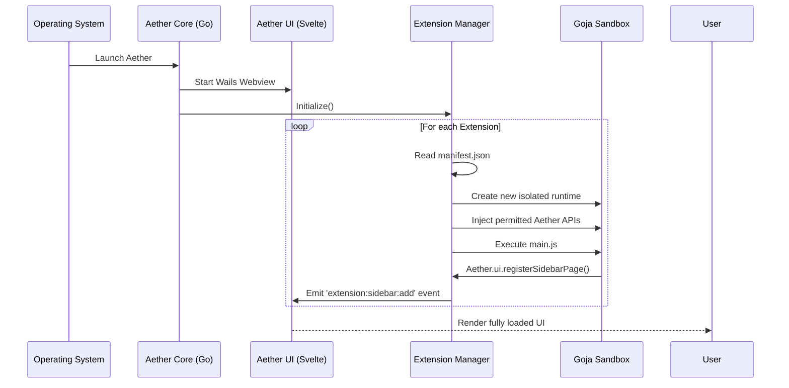
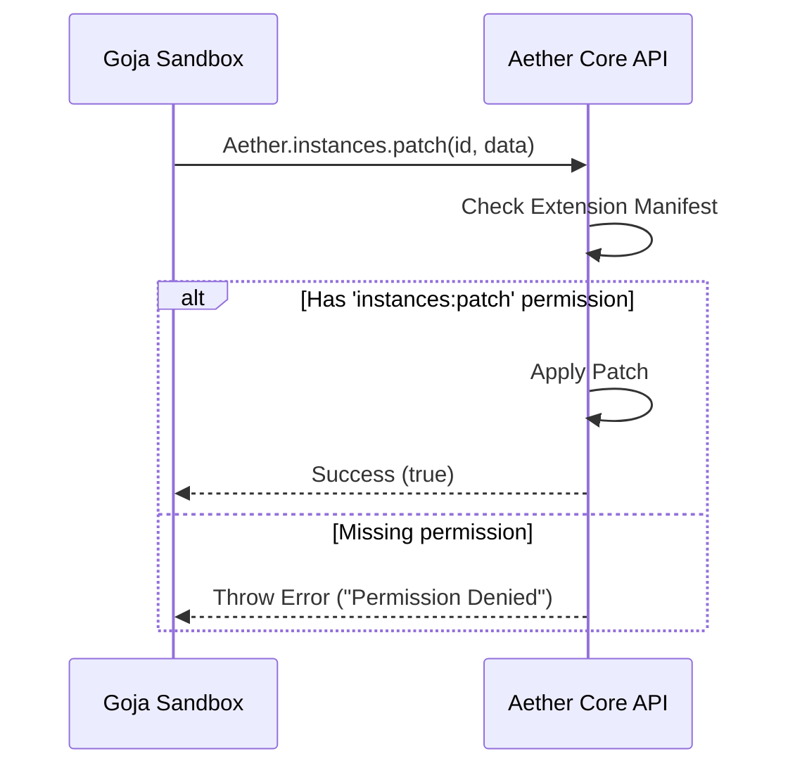

# Architecture

## Backend
The launcher backend is written in Go to ensure high performance, memory safety, and native compilation across Windows, macOS, and Linux. The backend operates completely headlessly and serves the frontend via Wails bindings. The frontend is a lightweight web view rendering the UI.

## Go Packages
- `main.go`: The main entry point.
- `pkg/instance`: Logic for managing Minecraft instances, resolving dependencies, and constructing launch arguments.
- `pkg/java`: Discovery, installation, and management of Java Runtimes (JRE/JDK).
- `pkg/auth`: Microsoft/Xbox authentication flow and token management.
- `pkg/extensions`: The extension manager and sandbox environment.

## Extension Manager
The Extension Manager (`pkg/extensions`) is responsible for discovering, validating, and executing extensions. 
Extensions are executed in an isolated JavaScript runtime (Goja). They do not have direct access to the host OS. Any action an extension wants to perform must be requested through the launcher's API, which enforces the capability-based permission model.

## Updater
The updater is built into the core launcher but operates independently.
- **Launcher Updates**: The launcher downloads new binaries in the background and swaps them on the next restart.
- **Extension Updates**: Extensions are checked for updates periodically. Updates are applied automatically unless configured otherwise, minimizing user friction.

## Launcher Pipeline
1. **Resolution**: Determine the Minecraft version, loader (Fabric, Forge, etc.), and required libraries.
2. **Verification**: Check if all assets, libraries, and the Java runtime are present. Download missing files.
3. **Authentication**: Ensure the user has a valid session token. Refresh if necessary.
4. **Execution**: Construct the massive Java command line and spawn the child process.
5. **Monitoring**: Pipe standard output/error to the log manager and monitor the process state.

## Diagrams

### Launcher Startup & Extension Loading

### Permission Validation

